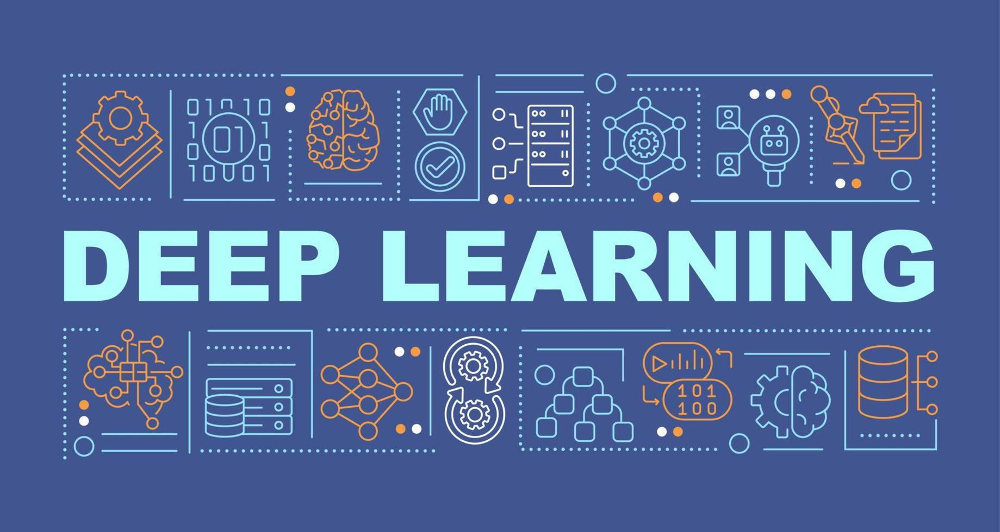

# AI Resources

> **Repository structure**
>
> • **online/** – curated markdown files that contain links to external resources (arXiv, journals, blog posts).  
> &nbsp;&nbsp;• Root level .md files – organized by AI/ML domains  
> &nbsp;&nbsp;• computer-vision/ – detailed CV papers organized by specific topics  
> • **offline/** – books & papers stored directly in the repo (PDF).  
> &nbsp;&nbsp;• offline/Books/ – textbooks, reference books  
> &nbsp;&nbsp;• offline/Papers/ – academic papers, slide decks, notes  
> • **diagrams/** – visual resources and timeline diagrams  
> • **scripts/** – utility scripts for repository maintenance  
>
> When you contribute, please read `CONTRIBUTING.md` for rules on adding new PDFs or links.

This repository contains books and documents related to Machine Learning and Deep Learning.
The goal is to create a clear and useful learning resource for study and reference to solve specific problems.
These are documents I have collected throughout my studies. I hope everyone will find it helpful!

If you find it useful, please give me a star ⭐. It will be the motivation for me to continue developing this repo.

If you don't know where to start learning, check out: [AI Roadmap](https://i.am.ai/roadmap/#machine-learning-roadmap).
This roadmap will help you learn all about ML and DL, then you can dive deeper into a specific area.

## Table Of Contents

- [📚 Offline Resources (PDF Files)](#-offline-resources-pdf-files)
  - [📖 Books](#-books)
  - [📄 Academic Papers](#-academic-papers)
- [🌐 Online Resources (Curated Links)](#-online-resources-curated-links)
  - [🖼️ Computer Vision](#️-computer-vision)
  - [🗣️ Natural Language Processing](#️-natural-language-processing)
  - [🎨 Generative Models](#-generative-models)
  - [🎮 Reinforcement Learning](#-reinforcement-learning)
  - [⚡ Optimization](#-optimization)
- [📊 Diagrams & Visualizations](#-diagrams--visualizations)
- [🛠️ Utilities](#️-utilities)

---

# 📚 Offline Resources (PDF Files)

## 📖 Books

### Database
- [Database Concepts](./offline/Books/Database/Database%20Concepts.pdf)
- [Databases: A Beginner's Guide](./offline/Books/Database/Databases%20A%20Beginners%20Guide.pdf)
- [Introduction to Database](./offline/Books/Database/introduction%20database.pdf)

### Deep Learning
- [Deep Learning with PyTorch](./offline/Books/Library/Deep%20Learning%20with%20PyTorch.pdf)
- [Deep Learning Basic (VN language)](./offline/Books/DeepLearning/Deep%20Learning%20Basic%20%28VN%20language%29.pdf)
- [Neural Networks from Scratch in Python](./offline/Books/DeepLearning/Neural%20Networks%20from%20Scratch%20in%20Python.pdf)
- [Understanding Deep Learning](./offline/Books/DeepLearning/Understanding%20Deep%20Learning.pdf)
- [Natural Language Processing with Python](./offline/Books/DeepLearning/natural%20language%20processing%20with%20python.pdf)
- [Practical Computer Vision](./offline/Books/DeepLearning/Practical%20computer%20vision.pdf)
- [Deep Learning from Scratch](./offline/Books/DeepLearning/Deep%20Learning%20from%20Scratch.pdf)
- [Deep Learning in Object Detection and Recognition](./offline/Books/DeepLearning/Deep%20learning%20in%20object%20detection%20and%20recognition.pdf)

### Machine Learning
- [Machine Learning Concepts](./offline/Books/Machine%20Learning/Machine%20Learning%20Concept.pdf)
- [AI and Machine Learning for Coders](./offline/Books/Machine%20Learning/AI%20and%20machine%20learning%20for%20coders%20a%20programmers%20guide%20to%20artificial%20intelligence%20.pdf)
- [Hands-On Machine Learning with C++](./offline/Books/Machine%20Learning/Hands%20On%20Machine%20Learning%20with%20C++%20Build.pdf)
- [Hands-On Machine Learning with Scikit-Learn, Keras, and TensorFlow](./offline/Books/Library/Hands-On-Machine-Learning-with-Scikit-Learn-Keras-and-Tensorflow.pdf)
- [Introduction to Probability for Data Science](./offline/Books/Machine%20Learning/Introduction%20to%20Probability%20for%20DataScience.pdf)
- [MLOps - Machine Learning Engineering in Action](./offline/Books/Machine%20Learning/MLOps%20-%20Machine%20Learning%20Engineering%20in%20Action.pdf)

### Linear Algebra & Mathematics
- [Linear Algebra (University of Vermont)](./offline/Books/Linear%20Algebra/Linear%20Algebra.pdf)
- [Linear Algebra from UC Davis](./offline/Books/Linear%20Algebra/Linear%20Algebra%20from%20UCDAVIS%20.pdf)
- [A First Course in Linear Algebra](./offline/Books/Linear%20Algebra/A%20First%20Course%20in%20Linear%20Algebra.pdf)
- [Mathematics for Machine Learning](./offline/Books/Library/mathematics%20for%20machine%20learning.pdf)
- [Math for Deep Learning](./offline/Books/Library/Math%20for%20deep%20learning.pdf)

### Programming Libraries
- [Learning Pandas](./offline/Books/Library/Leanrning%20padas.pdf)
- [NumPy Guide](./offline/Books/Library/numpy-3rd-edition-build-efficient-high-speed-programs-using-the-high-performance-numpy-mathematical-library_compress.pdf)
- [SciPy and NumPy](./offline/Books/Library/SciPyNumPy.pdf)

## 📄 Academic Papers

### Computer Vision
- **Classification Models**: ResNet, DenseNet, EfficientNet, MobileNet, SE-Net, ShuffleNet, SqueezeNet, InceptionNet
- **CNN Architectures**: Lightweight FCN, Conditional Convolution, CNN fundamentals
- **Vision Transformers**: ViT, Recent advances, CNN-Transformer hybrid models  
- **OCR**: Text Recognition, TrOCR Transformer-based OCR
- **Image Classification**: ConvNeXt, FractalNet, Inception-ResNet, NASNet, Xception
- **Action Recognition**: SlowFast Networks, Video Vision Transformer
- **Image Captioning**: Show, Attend and Tell
- **Object Detection**: YOLO series
- **Specialized Topics**: Mamba, MixUp Augmentation, High-Resolution Representation Learning

### Generative Adversarial Networks
- **Classic GANs**: DCGAN, WGAN, Progressive GAN
- **Conditional GANs**: Conditional GAN, AC-GAN, InfoGAN
- **Image-to-Image**: CycleGAN, StackGAN (v1 & v2)
- **Super Resolution**: SRGAN

### Sequence Models
- **RNNs**: Basic RNN concepts, implementations
- **LSTM**: Convolutional LSTM, Backpropagation in LSTM
- **GRU**: Gated Recurrent Units fundamentals
- **Transformers**: Attention mechanisms, Deep Transformer models
- **Modern Architectures**: Mamba - Linear Time Sequence Modeling
- **Word Embeddings**: Word embedding techniques

### Technical Papers
- **Normalization**: Batch Normalization, Layer Normalization
- **Regularization**: Dropout techniques
- **Optimization**: Adam optimizer, learning rate strategies
- **Training Techniques**: Transfer Learning, Graph mode execution
- **Neural Network Concepts**: Synthetic Gradients, Decoupled Neural Interfaces

### Evaluation & Metrics
- **Classification Metrics**: Model evaluation techniques
- **ROC Analysis**: ROC curves and cutoff analysis
- **Visualization**: Multiple evaluation metrics visualization

### Vietnamese AI Resources
- **Descriptions**: GNN, Multimodal LLMs, Diffusion Colorization, VAE
- **Slides**: Multimodal LLM, Math Solver with LLMs
- **Tutorials**: LangChain, Multi-task Learning

---

# 🌐 Online Resources (Curated Links)

## 🖼️ Computer Vision

📋 **Quick Access**: [computer-vision.md](./computer-vision.md) - Comprehensive curated list of CV papers with direct links

📁 **Detailed Topics**: [computer-vision/](./computer-vision/) folder contains specialized guides:
- [Landmark Papers](./computer-vision/00_landmark.md) - Historic milestones & must-read classics
- [Image Classification](./computer-vision/classification.md) - Classification models + Vision Transformers  
- [Object Detection](./computer-vision/detection.md) - Detection & instance segmentation
- [Semantic Segmentation](./computer-vision/segmentation.md) - Segmentation techniques
- [Video Understanding](./computer-vision/video-understanding.md) - Action recognition & video models
- [Self-Supervised Learning](./computer-vision/self-supervised.md) - Representation learning without labels

## 🗣️ Natural Language Processing
📋 **Coming Soon**: [natural-language-processing.md](./natural-language-processing.md)
> *This section is under development. Check back soon for curated NLP resources!*

## 🎨 Generative Models  
📋 **Coming Soon**: [generative-models.md](./generative-models.md)
> *This section is under development. Check back soon for generative AI resources!*

## 🎮 Reinforcement Learning
📋 **Coming Soon**: [reinforcement-learning.md](./reinforcement-learning.md)
> *This section is under development. Check back soon for RL resources!*

## ⚡ Optimization
📋 **Coming Soon**: [optimization.md](./optimization.md)
> *This section is under development. Check back soon for optimization techniques!*

---

## 📝 How to Use This Repository

1. **For Beginners**: Start with the [AI Roadmap](https://i.am.ai/roadmap/#machine-learning-roadmap) to understand learning paths
2. **For Specific Topics**: Browse the online curated lists for latest papers and resources
3. **For Deep Study**: Download PDFs from the offline collection for comprehensive learning
4. **For Visual Learners**: Check out the diagrams and timeline visualizations

---

**⭐ If you find this repository helpful, please give it a star to support continued development!**
