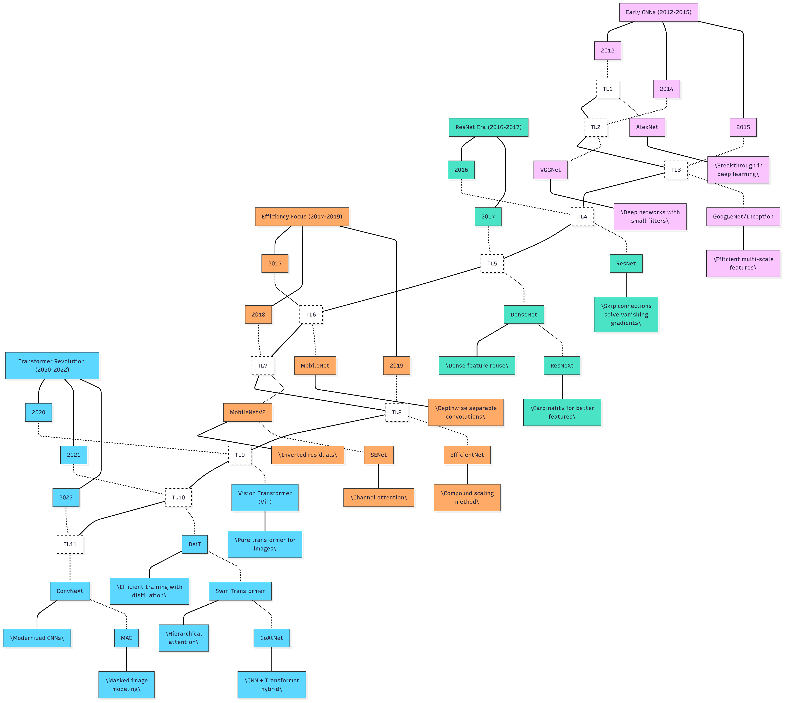

# 🖼️ Image Classification & Vision Transformers

> **Comprehensive Research Papers for Image Classification and Vision Transformers**  
> Start here if your goal is to recognize **what** is in an image.

This curated collection contains high-quality research papers from 2012 to present, organized by field and importance. Landmark papers that significantly impacted the field are marked with ⭐.

## **📊 Evolution of Image Classification Models**

The diagram below provides a visual timeline of how image classification models have evolved from 2012 to the present day, organized into four major eras:

1. **Early CNNs (2012-2015)**: Foundational convolutional architectures that launched the deep learning revolution
2. **ResNet Era (2016-2017)**: Introduction of skip connections and techniques to train deeper networks
3. **Efficiency Focus (2017-2019)**: Optimizing models for mobile and resource-constrained environments
4. **Transformer Revolution (2020-2022)**: Shift from CNNs to transformer-based architectures

Each model is shown with its key contribution to the field, demonstrating how innovations build upon previous work. The diagram highlights both landmark architectures and their derivatives that extended the original concepts.

## **📚 Table of Contents**

- [Convolutional Networks](#convolutional-networks)
  - [Foundation CNNs & Breakthrough Architectures](#foundation-cnns--breakthrough-architectures)
  - [Multi-scale & Feature Learning](#multi-scale--feature-learning)
- [Vision Transformers & Hybrids](#vision-transformers--hybrids)
  - [Original Vision Transformers & Derivatives](#original-vision-transformers--derivatives)
  - [Advanced Swin Transformers](#advanced-swin-transformers)
  - [Novel Attention Mechanisms](#novel-attention-mechanisms)
  - [Hybrid Models (CNN + Transformer)](#hybrid-models-cnn--transformer)
  - [Domain-Specific Applications](#domain-specific-applications)
- [Efficient Architectures](#efficient-architectures)
  - [MobileNets & Lightweight Models](#mobilenets--lightweight-models)
  - [EfficientNets](#efficientnets)
  - [Compact Transformers](#compact-transformers)
- [Novel Techniques & Methods](#novel-techniques--methods)
  - [Advanced Training Techniques](#advanced-training-techniques)
  - [Attention & Feature Enhancement](#attention--feature-enhancement)
  - [Knowledge Distillation & Compression](#knowledge-distillation--compression)
  - [Hardware-Aware Optimization](#hardware-aware-optimization)
- [Comparative Studies & Surveys](#comparative-studies--surveys)
  - [Vision Transformers vs CNNs](#vision-transformers-vs-cnns)
  - [Architecture Surveys](#architecture-surveys)

---

## **Convolutional Networks**

### Foundation CNNs & Breakthrough Architectures

- **"ImageNet Classification with Deep Convolutional Neural Networks"** – *NIPS 2012* ⭐  
  https://arxiv.org/abs/1203.02156  
  *AlexNet landmark paper that launched the deep learning era in computer vision*

- **"Very Deep Convolutional Networks for Large-Scale Image Recognition"** – *ICLR 2015* ⭐  
  https://arxiv.org/abs/1409.1556  
  *VGGNet with deep architecture using small 3x3 filters*

- **"Going Deeper with Convolutions"** – *CVPR 2015* ⭐  
  https://arxiv.org/abs/1409.4842  
  *GoogLeNet/Inception with Inception modules for computational efficiency*

- **"Deep Residual Learning for Image Recognition"** – *CVPR 2016* ⭐  
  https://arxiv.org/abs/1512.03385  
  *ResNet solves vanishing gradient problem with skip connections*

- **"Identity Mappings in Deep Residual Networks"** – *ECCV 2016*  
  https://arxiv.org/abs/1603.05027  
  *Improved ResNet with better identity mappings*

- **"Densely Connected Convolutional Networks"** – *CVPR 2017* ⭐  
  https://arxiv.org/abs/1608.06993  
  *DenseNet with dense connections between layers for optimal feature reuse*

- **"Xception: Deep Learning with Depthwise Separable Convolutions"** – *CVPR 2017*  
  https://arxiv.org/abs/1610.02357  
  *Extreme Inception with depthwise separable convolutions*

### Multi-scale & Feature Learning

- **"Feature Pyramid Networks for Object Detection"** – *CVPR 2017*  
  https://arxiv.org/abs/1612.03144  
  *FPN for efficient multi-scale feature learning*

- **"Aggregated Residual Transformations for Deep Neural Networks"** – *CVPR 2017*  
  https://arxiv.org/abs/1611.05431  
  *ResNeXt with cardinality for better feature representation*

- **"Inception-v4, Inception-ResNet and the Impact of Residual Connections on Learning"** – *AAAI 2017*  
  https://arxiv.org/abs/1602.07261  
  *Advanced Inception architectures with residual connections*

---

## **Vision Transformers & Hybrids**

### Original Vision Transformers & Derivatives

- **"Attention Is All You Need"** – *NIPS 2017* ⭐  
  https://arxiv.org/abs/1706.03762  
  *Foundation Transformer architecture for Vision Transformers*

- **"An Image is Worth 16x16 Words: Transformers for Image Recognition at Scale"** – *ICLR 2021* ⭐  
  https://arxiv.org/abs/2010.11929  
  *ViT: First pure transformer applied to image classification*

- **"Training data-efficient image transformers & distillation through attention"** – *ICML 2021*  
  https://arxiv.org/abs/2012.12877  
  *DeiT with knowledge distillation for efficient training*

- **"Swin Transformer: Hierarchical Vision Transformer using Shifted Windows"** – *ICCV 2021* ⭐  
  https://arxiv.org/abs/2103.14030  
  *Hierarchical ViT with shifted window attention*

- **"Twins: Revisiting the Design of Spatial Attention in Vision Transformers"** – *NeurIPS 2021*  
  https://arxiv.org/abs/2104.13840  
  *Efficient spatial attention design for ViTs*

### Advanced Swin Transformers

- **"Swin Transformer V2: Scaling Up Capacity and Resolution"** – *CVPR 2022* ⭐  
  https://arxiv.org/abs/2111.09883  
  *Scaling Swin Transformer up to 3 billion parameters with post-normalization, scaled cosine attention, and log-spaced continuous position bias*

- **"Improved Deep Learning Image Classification Algorithm Based on Swin Transformer V2"** – *PeerJ Computer Science 2023*  
  https://peerj.com/articles/cs-1665  
  *Enhanced Swin Transformer V2 with CNN and Transformer hybrid approach using multi-branch downsampling and inverted residual feed-forward network*

### Novel Attention Mechanisms

- **"ViT-LSLA: Vision Transformer with Light Self-Limited-Attention"** – *arXiv 2022*  
  https://arxiv.org/abs/2210.17115  
  *Lightweight attention mechanism for efficient ViTs*

- **"CP-ViT: Cascade Vision Transformer Pruning via Progressive Sparsity Prediction"** – *arXiv 2022*  
  https://arxiv.org/abs/2203.04570  
  *Progressive pruning method for ViT efficiency*

- **"Q-ViT: Fully Differentiable Quantization for Vision Transformer"** – *arXiv 2022*  
  https://arxiv.org/abs/2201.07703  
  *Quantization technique for ViT deployment*

### Hybrid Models (CNN + Transformer)

- **"CoAtNet: Marrying Convolution and Attention for All Data Sizes"** – *NIPS 2021* ⭐  
  https://arxiv.org/abs/2106.04803  
  *Hybrid architecture efficiently combining CNN and Transformer*

- **"CvT: Introducing Convolutions to Vision Transformers"** – *ICCV 2021*  
  https://arxiv.org/abs/2103.15808  
  *Convolutional Vision Transformer with conv in attention*

- **"Pyramid Vision Transformer: A Versatile Backbone for Dense Prediction without Convolutions"** – *ICCV 2021*  
  https://arxiv.org/abs/2102.12122  
  *Pyramid structure in ViT for dense prediction tasks*

- **"HM-ViT: Hetero-modal Vehicle-to-Vehicle Cooperative Perception with Vision Transformer"** – *arXiv 2023*  
  https://arxiv.org/abs/2304.10628  
  *Multi-agent cooperative framework with heterogeneous 3D graph transformer for LiDAR and camera fusion*

- **"CLFT: Camera-LiDAR Fusion Transformer for Semantic Segmentation in Autonomous Driving"** – *arXiv 2024*  
  https://arxiv.org/abs/2404.17793  
  *Progressive-assemble strategy with double-direction network and cross-fusion for multimodal perception*

- **"M2DA: Multi-Modal Fusion Transformer Incorporating Driver Attention for Autonomous Driving"** – *arXiv 2024*  
  https://arxiv.org/abs/2403.12552  
  *LiDAR-Vision-Attention-based Fusion module integrating driver attention for improved perception*

### Domain-Specific Applications

- **"High-Resolution Swin Transformer for Automatic Medical Image Segmentation"** – *Sensors 2023*  
  https://www.mdpi.com/1424-8220/23/7/3420  
  *HRSTNet combining convolutional layers with Transformer blocks for medical image segmentation*

- **"Classification of Keratitis from Eye Corneal Photographs using Deep Learning"** – *arXiv 2024*  
  https://arxiv.org/abs/2411.08935  
  *Deep learning application for keratitis diagnosis with AUROC 0.74-0.96 across bacterial, fungal, and amoebic types*

- **"PLC-Fusion: Perspective-Based Hierarchical and Deep LiDAR Camera Fusion for 3D Object Detection"** – *Information 2024*  
  https://www.mdpi.com/2078-2489/15/11/739  
  *LiDAR-camera fusion framework with CamViT and LidViT, achieving 83.52% mAP for 3D detection*

- **"ViT-FuseNet: Multimodal Fusion of Vision Transformer for Vehicle-Infrastructure Cooperative Perception"** – *IEEE 2024*  
  https://ieeexplore.ieee.org/document/10440607/  
  *Cooperative perception framework with cross-attention mechanism, improving 3D-mAP by 6.17%*

---

## **Efficient Architectures**

### MobileNets & Lightweight Models

- **"MobileNets: Efficient Convolutional Neural Networks for Mobile Vision Applications"** – *arXiv 2017* ⭐  
  https://arxiv.org/abs/1704.04861  
  *Depthwise separable convolutions for mobile deployment*

- **"MobileNetV2: Inverted Residuals and Linear Bottlenecks"** – *CVPR 2018*  
  https://arxiv.org/abs/1801.04381  
  *Inverted residual design for better efficiency*

- **"Searching for MobileNetV3"** – *ICCV 2019* ⭐  
  https://arxiv.org/abs/1905.02244  
  *Combining hardware-aware NAS with NetAdapt algorithm, introducing h-swish activation and efficient LR-ASPP segmentation decoder*

- **"NetAdapt: Platform-Aware Neural Network Adaptation for Mobile Applications"** – *ECCV 2018*  
  https://arxiv.org/abs/1804.03230  
  *Algorithm for automatically adapting pre-trained neural networks to mobile platforms with specific resource budgets*

- **"SqueezeNet: AlexNet-level accuracy with 50x fewer parameters and <0.5MB model size"** – *arXiv 2016*  
  https://arxiv.org/abs/1602.07360  
  *Extremely compact CNN with fire modules*

- **"ShuffleNet: An Extremely Efficient Convolutional Neural Network for Mobile Devices"** – *CVPR 2018*  
  https://arxiv.org/abs/1707.01083  
  *Channel shuffle for efficient mobile architectures*

- **"ShuffleNet V2: Practical Guidelines for Efficient CNN Architecture Design"** – *ECCV 2018*  
  https://arxiv.org/abs/1807.11164  
  *Improved ShuffleNet with practical design guidelines*

### EfficientNets

- **"EfficientNet: Rethinking Model Scaling for Convolutional Neural Networks"** – *ICML 2019* ⭐  
  https://arxiv.org/abs/1905.11946  
  *Compound scaling method for CNN efficiency*

- **"EfficientNetV2: Smaller Models and Faster Training"** – *ICML 2021*  
  https://arxiv.org/abs/2104.00298  
  *Progressive learning and improved training for EfficientNet*

### Compact Transformers

- **"TRT-ViT: TensorRT-oriented Vision Transformer"** – *arXiv 2022*  
  https://arxiv.org/abs/2205.09579  
  *Hardware-aware ViT design for deployment*

- **"Mask-guided Vision Transformer (MG-ViT) for Few-Shot Learning"** – *arXiv 2022*  
  https://arxiv.org/abs/2205.09995  
  *Efficient ViT for few-shot learning applications*

---

## **Novel Techniques & Methods**

### Advanced Training Techniques

- **"Masked Autoencoders Are Scalable Vision Learners"** – *CVPR 2022* ⭐  
  https://arxiv.org/abs/2111.06377  
  *Self-supervised learning with masked image modeling*

- **"A ConvNet for the 2020s"** – *CVPR 2022*  
  https://arxiv.org/abs/2201.03545  
  *ConvNeXt: Modernizing CNN design with Transformer insights*

- **"Batch Normalization: Accelerating Deep Network Training by Reducing Internal Covariate Shift"** – *ICML 2015*  
  https://arxiv.org/abs/1502.03167  
  *Batch normalization for stable and faster training*

- **"Layer Normalization"** – *arXiv 2016*  
  https://arxiv.org/abs/1607.06450  
  *Alternative normalization technique for better training*

### Attention & Feature Enhancement

- **"Squeeze-and-Excitation Networks"** – *CVPR 2018*  
  https://arxiv.org/abs/1709.01507  
  *Channel attention mechanism for CNN improvement*

- **"CBAM: Convolutional Block Attention Module"** – *ECCV 2018*  
  https://arxiv.org/abs/1807.06521  
  *Combined spatial and channel attention*

- **"Non-local Neural Networks"** – *CVPR 2018*  
  https://arxiv.org/abs/1711.07971  
  *Self-attention for capturing long-range dependencies in CNNs*

### Knowledge Distillation & Compression

- **"Distilling the Knowledge in a Neural Network"** – *NIPS 2014 Workshop*  
  https://arxiv.org/abs/1503.02531  
  *Knowledge distillation for model compression*

- **"Deep Compression: Compressing Deep Neural Networks with Pruning, Trained Quantization and Huffman Coding"** – *ICLR 2016*  
  https://arxiv.org/abs/1510.00149  
  *Comprehensive model compression techniques*

### Hardware-Aware Optimization

- **"Model Quantization and Hardware Acceleration for Vision Transformers: A Comprehensive Survey"** – *arXiv 2024*  
  https://arxiv.org/abs/2405.00314  
  *Survey on quantization techniques and hardware acceleration for ViTs deployment*

---

## **Comparative Studies & Surveys**

### Vision Transformers vs CNNs

- **"Vision Transformers for Image Classification: A Comparative Survey"** – *Technologies 2023*  
  https://www.mdpi.com/2227-7080/13/1/32  
  *Comprehensive survey on ViT for image classification, comparing advantages and limitations with CNNs through experiments*

- **"Exploring the Synergies of Hybrid CNNs and ViTs Architectures for Computer Vision: A Survey"** – *arXiv 2024*  
  https://arxiv.org/abs/2402.02941  
  *Comprehensive review of hybrid CNN-ViT architectures and their synergistic benefits*

- **"A Comparative Survey of Vision Transformers for Feature Extraction in Texture Analysis"** – *arXiv 2024*  
  https://arxiv.org/abs/2406.06136  
  *Evaluation of 21 ViT variants for texture recognition, showing ViTs generally outperform CNNs*

### Architecture Surveys

- **"A Comprehensive Survey on Architectural Advances in Deep CNNs: Challenges, Applications, and Emerging Research Directions"** – *arXiv 2023*  
  https://arxiv.org/abs/2503.16546  
  *Comprehensive survey on CNN architectures from 2015-2023 with emerging learning paradigms*

- **"Vision Transformers in Precision Agriculture: A Comprehensive Survey"** – *arXiv 2023*  
  https://arxiv.org/abs/2504.21706  
  *ViT applications in agriculture with comparative analysis between CNN and ViT approaches*

---