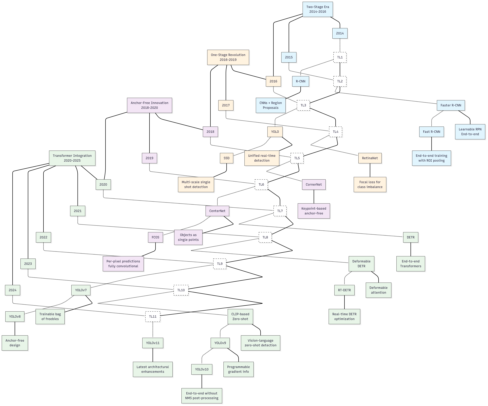

# Object Detection

> **Comprehensive Research Papers for Object Detection**  
> Algorithms that answer **where** and **what** objects are in an image.

This curated collection contains high-quality research papers from 2014 to present, organized by methodology and importance. Landmark papers that significantly impacted the field are marked with ⭐.

## **📊 Evolution of Object Detection Models**

The diagram below provides a visual timeline of how object detection models have evolved from 2014 to the present day, organized into major methodological approaches:

1. **Two-Stage Era (2014-2016)**: R-CNN family with separate region proposal and classification
2. **One-Stage Revolution (2016-2019)**: YOLO and SSD enabling real-time detection
3. **Anchor-Free Innovation (2018-2020)**: Eliminating hand-crafted anchor boxes
4. **Transformer Integration (2020-2025)**: End-to-end detection with attention mechanisms

Each model is shown with its key contribution to the field, demonstrating how innovations build upon previous work and address specific challenges in object detection.

## **📚 Table of Contents**

- [One-Stage Detectors](#one-stage-detectors)
  - [YOLO Series](#yolo-series-you-only-look-once)
  - [SSD and RetinaNet Family](#ssd-and-retinanet-family)
  - [EfficientDet and Mobile Detectors](#efficientdet-and-mobile-detectors)
- [Two-Stage Detectors](#two-stage-detectors)
  - [R-CNN Family](#r-cnn-family)
  - [Instance Segmentation](#instance-segmentation)
  - [Feature Pyramid Networks](#feature-pyramid-networks)
- [Transformer-Based Detectors](#transformer-based-detectors)
  - [DETR Family](#detr-family)
  - [Modern DETR Variants](#modern-detr-variants)
- [Anchor-Free Detectors](#anchor-free-detectors)
  - [Keypoint-Based Methods](#keypoint-based-methods)
  - [Dense Prediction Methods](#dense-prediction-methods)
- [Real-Time Detection](#real-time-detection)
  - [Real-Time Optimization](#real-time-optimization)
- [Mobile & Lightweight Detectors](#mobile--lightweight-detectors)
  - [Mobile & Lightweight Architectures](#mobile--lightweight-architectures)
- [3D Object Detection](#3d-object-detection)
  - [Point Cloud-Based Methods](#point-cloud-based-methods)
  - [Autonomous Driving 3D Detection](#autonomous-driving-3d-detection)
- [Video Object Detection](#video-object-detection)
  - [Temporal Aggregation Methods](#temporal-aggregation-methods)
  - [Transformer-Based Video Detection](#transformer-based-video-detection)
- [Multi-Scale & Feature Pyramid](#multi-scale--feature-pyramid)
- [Weakly-Supervised Detection](#weakly-supervised-detection)
- [Self-Supervised Detection](#self-supervised-detection)
- [Few-Shot & Zero-Shot Detection](#few-shot--zero-shot-detection)
  - [Few-Shot Object Detection](#few-shot-object-detection)
  - [Cross-Domain Few-Shot Detection](#cross-domain-few-shot-detection)
  - [Zero-Shot Object Detection](#zero-shot-object-detection)
  - [Open-Vocabulary Detection](#open-vocabulary-detection)
  - [Zero-Shot for Specialized Applications](#zero-shot-for-specialized-applications)
  - [Cross-Modal Zero-Shot Detection](#cross-modal-zero-shot-detection)
- [Domain Adaptation](#domain-adaptation)
- [Loss Functions & Training Strategies](#loss-functions--training-strategies)
  - [Advanced Loss Functions](#advanced-loss-functions)
  - [Training Optimization](#training-optimization)
- [Data Augmentation](#data-augmentation)
- [Evaluation Metrics & Benchmarks](#evaluation-metrics--benchmarks)
  - [Major Benchmarks](#major-benchmarks)
  - [Aerial and Satellite Benchmarks](#aerial-and-satellite-benchmarks)
  - [Autonomous Driving Benchmarks](#autonomous-driving-benchmarks)
  - [Face Detection Benchmarks](#face-detection-benchmarks)
  - [Specialized Datasets](#specialized-datasets)
  - [Error Analysis and Evaluation Tools](#error-analysis-and-evaluation-tools)
  - [Safety and Reliability Evaluation](#safety-and-reliability-evaluation)
- [Applications & Specialized Domains](#applications--specialized-domains)
  - [Medical Imaging](#medical-imaging)
  - [Security & Surveillance](#security--surveillance)
  - [Autonomous Driving](#autonomous-driving)
  - [Industrial Applications](#industrial-applications)
  - [Satellite & Remote Sensing](#satellite--remote-sensing)
  - [Agricultural Applications](#agricultural-applications)

---

## **One-Stage Detectors**

> Single-stage detectors perform detection in one forward pass, offering advantages in speed and simplicity.

### YOLO Series (You Only Look Once)

- **"You Only Look Once: Unified, Real-Time Object Detection"** – *CVPR 2016* ⭐ 
  https://arxiv.org/abs/1506.02640
  *Revolutionary unified approach treating object detection as single regression problem*

- **"YOLO9000: Better, Faster, Stronger"** – *CVPR 2017* ⭐ 
  *YOLOv2 with improved architecture and ability to detect over 9000 object categories*

- **"YOLOv3: An Incremental Improvement"** – *arXiv 2018* ⭐ 
  https://arxiv.org/abs/1804.02767
  *Multi-scale predictions with Darknet-53 backbone and improved accuracy*

- **"YOLOv4: Optimal Speed and Accuracy of Object Detection"** – *arXiv 2020* ⭐ 
  https://arxiv.org/abs/2004.10934  
  *Bag of freebies and specials for improved training and inference*

- **"YOLOv7: Trainable bag-of-freebies sets new state-of-the-art for real-time object detectors"** – *CVPR 2023* ⭐ 
  https://arxiv.org/abs/2207.02696
  *Novel trainable bag-of-freebies for improved accuracy without increasing inference cost*

- **"YOLOv8: A New State-of-the-Art for Object Detection"** – *Ultralytics 2023* ⭐ 
  *Anchor-free design with improved backbone and neck architecture*

- **"YOLOv9: Learning What You Want to Learn Using Programmable Gradient Information"** – *arXiv 2024* ⭐ 
  https://arxiv.org/abs/2402.13616  
  *Programmable gradient information for improved learning efficiency*

- **"YOLOv10: Real-Time End-to-End Object Detection"** – *arXiv 2024* ⭐ 
  https://arxiv.org/abs/2405.14458  
  *End-to-end optimization eliminating non-maximum suppression during inference*

- **"YOLOv11: An Overview of the Key Architectural Enhancements"** – *arXiv 2024* ⭐ 
  https://arxiv.org/abs/2410.17725  
  *Latest architectural improvements for enhanced detection performance*

### SSD and RetinaNet Family

- **"SSD: Single Shot MultiBox Detector"** – *ECCV 2016* ⭐ 
  https://arxiv.org/abs/1512.02325  
  *Multi-scale feature maps for detecting objects at various scales in single shot*

- **"DSSD: Deconvolutional Single Shot Detector"** – *arXiv 2017*  
  https://arxiv.org/abs/1701.06659  
  *Deconvolutional layers for improved small object detection*

- **"Focal Loss for Dense Object Detection"** – *ICCV 2017* ⭐ (RetinaNet)  
  https://arxiv.org/abs/1708.02002  
  *Focal loss addressing class imbalance in dense object detectors*

### EfficientDet and Mobile Detectors

- **"EfficientDet: Scalable and Efficient Object Detection"** – *CVPR 2020* ⭐ 
  https://arxiv.org/abs/1911.09070  
  *Compound scaling for object detection with BiFPN for efficient multi-scale feature fusion*

- **"NanoDet: Extremely Lightweight Object Detector for Edge Devices"** – *arXiv 2021*  
  https://github.com/RangiLyu/nanodet  
  *Ultra-lightweight detector optimized for mobile and edge deployment*

- **"MobileNets: Efficient Convolutional Neural Networks for Mobile Vision Applications"** – *arXiv 2017*  
  https://arxiv.org/abs/1704.04861  
  *Depthwise separable convolutions foundation for mobile detection architectures*

---

## **Two-Stage Detectors**

> Two-stage detectors separate region proposal and classification, typically achieving higher accuracy.

### R-CNN Family

- **"Rich Feature Hierarchies for Accurate Object Detection and Semantic Segmentation"** – *CVPR 2014* ⭐ (R-CNN)  
  https://arxiv.org/abs/1311.2524
  *Pioneering work combining CNNs with region proposals for object detection*

- **"Fast R-CNN"** – *ICCV 2015* ⭐ 
  https://arxiv.org/abs/1504.08083
  *End-to-end training with ROI pooling for improved speed and accuracy*

- **"Faster R-CNN: Towards Real-Time Object Detection with Region Proposal Networks"** – *NIPS 2015* ⭐ 
  https://arxiv.org/abs/1506.01497
  *Region Proposal Network (RPN) for learnable region proposals*

### Instance Segmentation

- **"Mask R-CNN"** – *ICCV 2017* ⭐ 
  https://arxiv.org/abs/1703.06870
  *Extension of Faster R-CNN for instance segmentation with mask prediction branch*

### Feature Pyramid Networks

- **"Feature Pyramid Networks for Object Detection"** – *CVPR 2017* ⭐ 
  https://arxiv.org/abs/1612.03144  
  *Multi-scale feature representation through top-down pathway and lateral connections*

- **"PANet: Path Aggregation Network for Instance Segmentation"** – *CVPR 2018*  
  https://arxiv.org/abs/1803.01534  
  *Bottom-up path augmentation for improved information flow*

---

## **Transformer-Based Detectors**

> End-to-end detection using Transformer architecture, eliminating many hand-crafted components.

### DETR Family

- **"End-to-End Object Detection with Transformers"** – *ECCV 2020* ⭐ (DETR)  
  https://arxiv.org/abs/2005.12872
  *First end-to-end object detector using Transformers with set prediction*

- **"Deformable DETR: Deformable Transformers for End-to-End Object Detection"** – *ICLR 2021* ⭐ 
  https://arxiv.org/abs/2010.04159  
  *Deformable attention mechanisms for faster convergence and better performance*

- **"Conditional DETR for Fast Training Convergence"** – *ICCV 2021*  
  https://arxiv.org/abs/2108.06152  
  *Conditional spatial query for accelerated training convergence*

### Modern DETR Variants

- **"RT-DETR: DETRs Beat YOLOs on Real-time Object Detection"** – *arXiv 2023* ⭐ 
  https://arxiv.org/abs/2304.08069  
  *Real-time DETR with efficient hybrid encoder and uncertainty-minimal query selection*

- **"LW-DETR: A Transformer Replacement to YOLO for Real-Time Detection"** – *arXiv 2024*  
  https://arxiv.org/abs/2406.03459  
  *Lightweight DETR architecture optimized for real-time applications*

- **"DEYOv3: DETR with YOLO for Real-time Object Detection"** – *arXiv 2023*  
  https://arxiv.org/abs/2309.11851  
  *Hybrid approach combining DETR and YOLO strengths*

---

## **Anchor-Free Detectors**

> Modern approaches that eliminate the need for predefined anchor boxes.

### Keypoint-Based Methods

- **"CornerNet: Detecting Objects as Paired Keypoints"** – *ECCV 2018* ⭐ 
  https://arxiv.org/abs/1808.01244  
  *Object detection as keypoint estimation using corner pooling*

- **"CenterNet: Keypoint Triplets for Object Detection"** – *ICCV 2019* ⭐ 
  https://arxiv.org/abs/1904.08189  
  *Triplet keypoints (corner + center) for improved object detection*

- **"Objects as Points"** – *arXiv 2019* ⭐ (CenterNet v2)  
  https://arxiv.org/abs/1904.07850  
  *Simplified object detection by representing objects as single points*

- **"ExtremeNet: Bottom-up Object Detection by Grouping Extreme and Center Points"** – *CVPR 2019*  
  https://arxiv.org/abs/1901.08043  
  *Four extreme points and one center point for object representation*

### Dense Prediction Methods

- **"FCOS: Fully Convolutional One-Stage Object Detection"** – *ICCV 2019* ⭐ 
  https://arxiv.org/abs/1904.01355  
  *Per-pixel prediction approach eliminating anchor boxes entirely*

---

## **Real-Time Detection**

> High-speed detection methods optimized for real-time applications.

### Real-Time Optimization

- **"Squeezed Edge YOLO: Onboard Object Detection on Edge Devices"** – *arXiv 2023*  
  https://arxiv.org/abs/2312.11716  
  *Optimized YOLO variant for resource-constrained edge devices*

- **"YOLO-SPD: Tiny objects localization on remote sensing based on You Only Look Once and Space-to-Depth Convolution"** – *IEEE 2024*  
  https://ieeexplore.ieee.org/document/10444386/  
  *Space-to-depth convolution for improved small object detection*

### Model Compression Techniques

- **"Combining TL and KD for Object Detection Model Compression"** – *IEEE 2024*  
  *Transfer learning and knowledge distillation for YOLOv5n compression*

- **"A survey of model compression strategies for object detection"** – *Multimedia Tools Applications 2024* ⭐ 
  *Comprehensive survey on network pruning, quantization, knowledge distillation*

- **"Infra-YOLO: Efficient Neural Network Structure with Model Compression for Real-Time Infrared Small Object Detection"** – *arXiv 2024*  
  *Channel pruning method for embedded UAV deployment*

- **"Weight Distribution Based Model Compression Method for Object Detection System"** – *IEEE 2023*  
  *Automatic weight zeroing in convolutional layers for 60% computing reduction*

### Hardware-Specific Optimization

- **"Summary of the 2023 Low-Power Deep Learning Object Detection and Semantic Segmentation Multitask Model Compression Competition"** – *IEEE 2023*  
  *Low-power optimization strategies for traffic scene detection*

- **"Hybrid Model Compression Pipeline for Efficient Object Detection using Parallel Recurrent Convolutional Neural Networks"** – *JISEM 2025*  
  *Quantization and pruning with hybrid optimization algorithms*

---

## **Mobile & Lightweight Detectors**

> Efficient detection models designed for mobile devices and edge computing.

### Mobile & Lightweight Architectures

- **"MobileNet-SSD: Efficient Object Detection for Mobile Devices"** – *CVPRW 2017*  
  *Combination of MobileNet backbone with SSD for mobile deployment*

- **"Improved YOLOv5 Based on Attention Mechanism and FasterNet for Foreign Object Detection"** – *arXiv 2024*  
  https://arxiv.org/abs/2403.08499  
  *Enhanced YOLOv5 with attention mechanisms for improved efficiency*

### Neural Architecture Search for Mobile

- **"NAS-EOD: an end-to-end Neural Architecture Search method for Efficient Object Detection"** – *CVPR 2021* ⭐ 
  *End-to-end NAS for mobile detection with latency information*

- **"A Lightweight Object Detection Model Based on Neural Architecture Search"** – *ACM 2021*  
  *NAS-based lightweight feature extraction for YOLOv5s*

- **"Multi-Objective Evolutionary for Object Detection Mobile Architectures Search"** – *IEEE 2023*  
  *Evolutionary optimization method for mobile backbone search*

### Hardware-Aware Design

- **"A Comprehensive Survey on Hardware-Aware Neural Architecture Search"** – *arXiv 2021* ⭐ 
  *Review of hardware-aware NAS methods for resource-limited platforms*

- **"EExNAS: Early-Exit Neural Architecture Search Solutions for Low-Power Wearable Devices"** – *IEEE 2021*  
  *Platform-aware NAS with Early-Exit capability for wearable devices*

- **"LC-NAS: Latency Constrained Neural Architecture Search for Point Cloud Networks"** – *ECCV 2021*  
  *Latency-constrained search for point cloud detection in time-critical applications*

---

## **3D Object Detection**

> Methods for detecting objects in 3D space using point clouds, stereo vision, etc.

### Point Cloud-Based Methods

- **"PointNet: Deep Learning on Point Sets for 3D Classification and Segmentation"** – *CVPR 2017* ⭐ 
  https://arxiv.org/abs/1612.00593  
  *Pioneer work for direct learning on point clouds*

- **"PointNet++: Deep Hierarchical Feature Learning on Point Sets in a Metric Space"** – *NIPS 2017* ⭐ 
  https://arxiv.org/abs/1706.02413  
  *Hierarchical feature learning for better local pattern capture*

- **"Group-Free 3D Object Detection via Transformers"** – *ICCV 2021*  
  https://arxiv.org/abs/2104.00678  
  *Transformer-based 3D detection without grouping operations*

- **"PVTransformer: Point-to-Voxel Transformer for Scalable 3D Object Detection"** – *arXiv 2024*  
  https://arxiv.org/abs/2405.00444  
  *Efficient point-to-voxel transformation with Transformer architecture*

### Autonomous Driving 3D Detection

- **"PointPillars: Fast Encoders for Object Detection from Point Clouds"** – *CVPR 2019* ⭐ 
  https://arxiv.org/abs/1812.05784  
  *Efficient pillar-based encoding for real-time 3D detection*

- **"Frustum PointVoxel-RCNN: A High-Performance Framework for Accurate 3D Object Detection"** – *IEEE 2024*  
  https://ieeexplore.ieee.org/document/10585339/  
  *Frustum-based approach combining point and voxel representations*

---

## **Video Object Detection**

> Temporal-aware detection in video sequences.

### Temporal Aggregation Methods

- **"Flow-Guided Feature Aggregation for Video Object Detection"** – *ICCV 2017* ⭐ 
  https://arxiv.org/abs/1703.10025  
  *Optical flow for temporal feature aggregation in video*

- **"Memory Enhanced Global-Local Aggregation for Video Object Detection"** – *CVPR 2020* ⭐ 
  https://arxiv.org/abs/2003.12063  
  *Memory mechanism for long-term temporal modeling*

- **"Sequence Level Semantics Aggregation for Video Object Detection"** – *ICCV 2019*  
  https://arxiv.org/abs/1907.06390  
  *Sequence-level feature aggregation for improved video detection*

- **"Temporal Aggregation with Context Focusing for Few-Shot Video Object Detection"** – *IEEE TIP 2024*  
  *TACF framework with context focusing and temporal aggregation modules*

- **"Beyond Boxes: Mask-Guided Spatio-Temporal Feature Aggregation for Video Object Detection"** – *IEEE TCSVT 2024*  
  *FAIM method with instance mask-based feature aggregation*

- **"Patchwise Temporal–Spatial Feature Aggregation Network for Object Detection in Satellite Video"** – *IEEE GRSL 2024*  
  *PTFA network for extremely small objects in satellite video*

### Transformer-Based Video Detection

- **"TransVOD: End-to-End Video Object Detection With Spatial-Temporal Transformers"** – *TPAMI 2022*  
  https://arxiv.org/abs/2201.05047  
  *Transformer architecture for spatio-temporal video object detection*

- **"End-to-End Video Object Detection with Spatial-Temporal Transformers"** – *ACM MM 2021*  
  https://arxiv.org/abs/2105.10920  
  *Joint spatial-temporal modeling with Transformer attention*

- **"LaneTCA: Enhancing Video Lane Detection with Temporal Context Aggregation"** – *arXiv 2024*  
  https://github.com/Alex-1337/LaneTCA  
  *Accumulative and adjacent attention modules for long-term and short-term temporal context*

- **"Toward Robust LiDAR-Camera Fusion in BEV Space via Mutual Deformable Attention and Temporal Aggregation"** – *IEEE TPAMI 2024*  
  *RobBEV detector with mutual deformable attention and temporal aggregation*

### Specialized Applications

- **"An innovative traffic flow detection model based on temporal video frame analysis and grayscale aggregation quantification"** – *IET Image Processing 2024*  
  *Traffic detection model with temporal analysis and edge computing optimization*

---

## **Multi-Scale & Feature Pyramid**

> Techniques for handling objects at different scales through feature pyramid networks and multi-scale training methods.

### Feature Pyramid Networks and Variants

- **"Feature Pyramid Networks for Object Detection"** – *CVPR 2017* ⭐ 
  https://arxiv.org/abs/1612.03144  
  *Top-down architecture with lateral connections to build semantic high-level feature maps at all scales*

- **"NAS-FPN: Learning Scalable Feature Pyramid Architecture for Object Detection"** – *CVPR 2019* ⭐ 
  https://arxiv.org/abs/1904.07850  
  *Neural Architecture Search to find optimal architecture for feature pyramid with cross-scale connections*

- **"Auto-FPN: Automatic Network Architecture Adaptation for Object Detection Beyond Classification"** – *CVPR 2020*  
  *End-to-end architecture search for both backbone and FPN components in object detection*

- **"Adaptive Feature Pyramid Networks for Object Detection"** – *IEEE 2021*  
  *Adaptive feature upsampling and fusion to solve feature misalignment and loss of details*

### Multi-Scale Training and Enhancement Methods

- **"UEFPN: Unified and Enhanced Feature Pyramid Networks for Small Object Detection"** – *ACM TOMM 2022*  
  *Unified domain features and Channel Attention Fusion to improve small object detection*

- **"Small-Object Detection in UAV-Captured Images via Multi-Branch Parallel Feature Pyramid Networks"** – *IEEE 2020*  
  *Multi-branch parallel architecture to extract features of small objects in UAV images*

- **"BiFPN-YOLO: One-stage object detection integrating Bi-Directional Feature Pyramid Networks"** – *Pattern Recognition 2025*  
  *Bi-directional feature pyramid integration into YOLO framework*

### Neural Architecture Search for FPN

- **"NAS-FCOS: Fast Neural Architecture Search for Object Detection"** – *CVPR 2020*  
  *Search FPN and prediction head of FCOS detector in 4 days with 8 V100 GPUs*

- **"FastDARTSDet: Fast Differentiable Architecture Joint Search on Backbone and FPN for Object Detection"** – *Applied Sciences 2022*  
  *Joint search backbone and FPN architectures using DARTS method*

- **"DAMO-YOLO: A Report on Real-Time Object Detection Design"** – *arXiv 2022*  
  *MAE-NAS guided search with Reparameterized Generalized-FPN (RepGFPN)*

---

## **Weakly-Supervised Detection**

> Object detection using only image-level annotations instead of detailed bounding box labels.

### Multiple Instance Learning Approaches

- **"PCL: Proposal Cluster Learning for Weakly Supervised Object Detection"** – *ICCV 2018* ⭐ 
  https://arxiv.org/abs/1807.03342  
  *Proposal clustering to learn refined instance classifiers through iterative process*

- **"C-MIL: Continuation Multiple Instance Learning for Weakly Supervised Object Detection"** – *CVPR 2019* ⭐ 
  https://arxiv.org/abs/1904.05316  
  *Continuation optimization to solve non-convexity problem in MIL*

- **"Continuation Multiple Instance Learning for Weakly and Fully Supervised Object Detection"** – *TPAMI 2021*  
  *Extension of C-MIL for both weakly and fully supervised detection tasks*

- **"Multiple Instance Graph Learning for Weakly Supervised Remote Sensing Object Detection"** – *IEEE TGRS 2021*  
  *Spatial graph-based vote and appearance graph-based instance mining*

### Image-Level Supervision Methods

- **"Cross-Domain Weakly-Supervised Object Detection Through Progressive Domain Adaptation"** – *CVPR 2018*  
  *Two-step progressive domain adaptation for cross-domain WSOD*

- **"Instance-Aware, Context-Focused, and Memory-Efficient Weakly Supervised Object Detection"** – *CVPR 2020* ⭐ 
  https://github.com/NVlabs/wetectron  
  *Instance-aware self-training algorithm with learnable Concrete DropBlock*

- **"Negative Deterministic Information-Based Multiple Instance Learning for Weakly Supervised Object Detection and Segmentation"** – *TPAMI 2024*  
  *NDI-MIL paradigm using negative deterministic information*

### Attention and Erasing Mechanisms

- **"Attention Erasing and Instance Sampling for Weakly Supervised Object Detection"** – *IEEE TIP 2024*  
  *Attention erasing scheme to capture integral extent of objects*

- **"Misclassification in Weakly Supervised Object Detection"** – *IEEE TIP 2024*  
  *Misclassification correction and tolerance mechanisms*

### Remote Sensing Applications

- **"Complete and Invariant Instance Classifier Refinement for Weakly Supervised Object Detection in Remote Sensing Images"** – *IEEE TGRS 2024*  
  *Complete definition of pseudo-soft labels and invariant MIL scheme*

- **"SAM-Induced Pseudo Fully Supervised Learning for Weakly Supervised Object Detection in Remote Sensing Images"** – *Remote Sensing 2024*  
  *Segment Anything Model to mine seed instances and pseudo-ground truth*

---

## **Self-Supervised Detection**

> Object detection learning without manual annotations through pretext tasks and contrastive learning.

### Contrastive Learning Methods

- **"HASSOD: Hierarchical Adaptive Self-Supervised Object Detection"** – *NeurIPS 2023* ⭐ 
  https://HASSOD-NeurIPS23.github.io  
  *Hierarchical adaptive clustering strategy with Mean Teacher framework*

- **"Self-EMD: Self-Supervised Object Detection without ImageNet"** – *arXiv 2020* ⭐ 
  https://arxiv.org/abs/2011.13677  
  *Earth Mover's Distance to compute similarity between embeddings*

- **"SeqCo-DETR: Sequence Consistency Training for Self-Supervised Object Detection with Transformers"** – *arXiv 2023* ⭐ 
  https://arxiv.org/abs/2303.08481  
  *Sequence consistency-based method for transformer object detection*

### Multi-Modal Self-Supervision

- **"Self-supervised object detection from audio-visual correspondence"** – *CVPR 2022*  
  *Audio component to teach object detector through contrastive objective*

- **"Self-Supervised Object Detection from Egocentric Videos"** – *ICCV 2023*  
  *DEVI method for class-agnostic detection from egocentric videos*

### Pretext Tasks and Auxiliary Learning

- **"Multi-Task Self-Supervised Object Detection via Recycling of Bounding Box Annotations"** – *CVPR 2019*  
  *Auxiliary tasks create labels by recycling bounding box annotations*

- **"A Study on Self-Supervised Object Detection Pretraining"** – *arXiv 2022*  
  *Framework to learn spatially consistent dense representation*

### Specialized Applications

- **"Single-shot self-supervised object detection in microscopy"** – *Nature Communications 2022* ⭐ 
  *LodeSTAR method exploiting roto-translational symmetries for microscopy*

---

## **Few-Shot & Zero-Shot Detection**

> Detection with limited training examples or novel categories.

### Few-Shot Object Detection

- **"Few-Shot Object Detection via Feature Reweighting"** – *ICCV 2019* ⭐ 
  https://arxiv.org/abs/1812.01866  
  *Meta-learning approach for few-shot detection with feature reweighting*

- **"Frustratingly Simple Few-Shot Object Detection"** – *ICML 2020* ⭐ 
  https://arxiv.org/abs/2003.06957  
  *Simple yet effective fine-tuning approach for few-shot detection*

- **"FSCE: Few-Shot Object Detection via Contrastive Proposal Encoding"** – *CVPR 2021*  
  https://arxiv.org/abs/2103.05950  
  *Contrastive learning for improved few-shot detection performance*

- **"DeFRCN: Decoupled Faster R-CNN for Few-Shot Object Detection"** – *ICCV 2021*  
  https://arxiv.org/abs/2108.09017  
  *Decoupled approach separating classification and localization in few-shot setting*

### Cross-Domain Few-Shot Detection

- **"Cross-Domain Few-Shot Object Detection via Enhanced Open-Set Object Detector"** – *arXiv 2024*  
  https://arxiv.org/abs/2402.03094  
  *Cross-domain adaptation for few-shot detection scenarios*

- **"Few-Shot Object Detection and Viewpoint Estimation for Objects in the Wild"** – *ECCV 2020*  
  https://arxiv.org/abs/2007.12107  
  *Joint few-shot detection and viewpoint estimation*

### Zero-Shot Object Detection

- **"Zero-shot Object Detection Through Vision-Language Embedding Alignment"** – *IEEE 2022* ⭐ 
  https://arxiv.org/abs/2109.12932  
  *Vision-language embedding alignment transferring CLIP generalization to YOLOv5 achieving SOTA on COCO, ILSVRC, Visual Genome*

- **"Single-stage zero-shot object detection network based on CLIP and pseudo-labeling"** – *Springer 2024*  
  *Single-stage approach combining CLIP embeddings with pseudo-labeling for zero-shot detection*

- **"Zero-shot object detection for infrared images using pre-trained vision and language models"** – *SPIE 2024*  
  *Two-stage detection system using YOLO region proposals followed by CLIP classification for infrared imagery*

- **"AnomalyCLIP: Object-agnostic Prompt Learning for Zero-shot Anomaly Detection"** – *arXiv 2023* ⭐ 
  https://arxiv.org/abs/2310.18961  
  *Object-agnostic text prompts capturing generic normality/abnormality across 17 anomaly detection datasets*

### Open-Vocabulary Detection

- **"Region-centric Image-Language Pretraining for Open-Vocabulary Detection"** – *arXiv 2024*  
  https://arxiv.org/abs/2310.00161  
  *Sets new SOTA of 37.6 mask APr on LVIS using ViT-L backbone and LAION dataset*

- **"CLIP-Count: Towards Text-Guided Zero-Shot Object Counting"** – *ACM MM 2023*  
  https://arxiv.org/abs/2305.12924  
  *End-to-end pipeline for open-vocabulary object counting with patch-text contrastive loss*

- **"Unseen No More: Unlocking the Potential of CLIP for Generative Zero-shot HOI Detection"** – *ACM MM 2024*  
  *HOIGen: First generation-based model using CLIP for zero-shot human-object interaction detection*

### Zero-Shot for Specialized Applications

- **"Automatic Prompt Generation and Grounding Object Detection for Zero-Shot Image Anomaly Detection"** – *IEEE 2024*  
  *Multi-modal pipeline using GPT-3, Grounding DINO, and CLIP for training-free industrial anomaly detection*

- **"Can an Embodied Agent Find Your 'Cat-shaped Mug'? LLM-Based Zero-Shot Object Navigation"** – *IEEE 2023*  
  *Language-guided exploration (LGX) algorithm achieving 27% improvement over OWL-ViT baseline on RoboTHOR*

- **"Leveraging Vision-Language Models for Open-Vocabulary Instance Segmentation and Tracking"** – *arXiv 2025*  
  *VLM-generated structured descriptions for open-vocabulary detection with video segmentation*

### Cross-Modal Zero-Shot Detection

- **"Audio-Visual Instance Segmentation"** – *arXiv 2025*  
  *AVIS framework combining audio and visual modalities for instance-level sound source localization*

- **"Better (pseudo-)labels for semi-supervised instance segmentation"** – *arXiv 2024*  
  *Semi-supervised approach achieving 2.8% AP improvement and 10.3% gain for rare classes on LVIS*

---

## **Domain Adaptation**

> Cross-domain object detection and sim-to-real transfer learning techniques.

### Adversarial Training Methods

- **"Confidence-Driven Region Mixing for Optical Remote Sensing Domain Adaptation Object Detection"** – *IEEE TGRS 2024*  
  *CR-Mixing framework with region-selective mixing and unbiased adversarial module*

- **"RFA-Net: Reconstructed Feature Alignment Network for Domain Adaptation Object Detection in Remote Sensing Imagery"** – *IEEE TGRS 2022*  
  *Sparse feature reconstruction to intensify instance features*

- **"Investigate an Intelligent Vehicle Domain Adaptation Object Detection Algorithm Based on Self-Training and Adversarial Training"** – *IEEE TITS 2024*  
  *Collaborative framework guided by uncertainty for self-training and adversarial training*

### Remote Sensing Domain Adaptation

- **"Rotation-Invariant and Relation-Aware Cross-Domain Adaptation Object Detection Network for Optical Remote Sensing Images"** – *Remote Sensing 2021*  
  *RIRA network with rotation-invariant regularizer and relation-aware graph*

- **"FIE-Net: Foreground Instance Enhancement Network for Domain Adaptation Object Detection in Remote Sensing Imagery"** – *IEEE TGRS 2024*  
  *Foreground-focused multigranularity feature alignment and label filtering*

### Few-Shot Domain Adaptation

- **"FsDAOD: Few-shot domain adaptation object detection for heterogeneous SAR image"** – *Computer Vision and Image Understanding 2025*  
  *Few-shot domain adaptation for SAR image detection*

- **"Coarse-to-fine domain adaptation object detection with feature disentanglement"** – *International Journal of Machine Learning and Cybernetics 2025*  
  *Feature disentanglement approach for domain adaptation*

---

## **Loss Functions & Training Strategies**

> Novel loss functions and training techniques for detection.

### Advanced Loss Functions

- **"Focal Loss for Dense Object Detection"** – *ICCV 2017* ⭐ (Focal Loss)  
  https://arxiv.org/abs/1708.02002  
  *Addressing class imbalance in one-stage detectors through focal loss*

- **"Distance-IoU Loss: Faster and Better Learning for Bounding Box Regression"** – *AAAI 2020* ⭐ 
  https://github.com/Zzh-tju/DIoU  
  *DIoU and CIoU losses incorporate normalized distance and aspect ratio*

- **"LCornerIoU: An Improved IoU-based Loss Function for Accurate Bounding Box Regression"** – *IEEE 2022*  
  *LCornerIoU loss with normalized corner distance and parameterized width-height difference*

- **"Valid-IoU: an improved IoU-based loss function and its application to detection of defects on printed circuit boards"** – *Multimedia Tools Applications 2024*  
  *VIoU loss to solve degradation problems in ICIoU*

- **"IA-CIOU: An Improved IOU Bounding Box Loss Function for SAR Ship Target Detection Methods"** – *IEEE TGRS 2024*  
  *Inner-alpha-CIOU for SAR ship detection with scale factor and robustness adjustment*

- **"Adaptive Focal Loss for Keypoint-Based Deep Learning Detectors"** – *IEEE 2024*  
  https://ieeexplore.ieee.org/document/10872927/  
  *Adaptive focal loss for improved keypoint-based detection*

### Training Optimization

- **"Knowledge Distillation for Object Detection: A Survey"** – *arXiv 2021*  
  *Comprehensive survey of knowledge distillation techniques for detection*

- **"Experimental Study on the Effect of Loss Function on Object Detection"** – *ACM 2021*  
  *Comparative study of Smooth L1, Balanced L1, IoU, GIoU, DIoU, CIoU losses*

- **"Improving YOLOv8 Deep learning model in rice disease detection by using Wise - IoU loss function"** – *Mathematical and Computer Applications 2025*  
  *WIoU loss function for agricultural applications*

- **"Occlusion Target Detection Based on Improved YOLOv5 Model"** – *IEEE 2023*  
  *CIoU loss with coordinate attention mechanism and kCIoU-NMS*

---

## **Data Augmentation**

> Augmentation strategies specifically designed for detection tasks.

### Copy-Paste Augmentation

- **"Background Instance-Based Copy-Paste Data Augmentation for Object Detection"** – *Electronics 2023*  
  *BIB-Copy-Paste model with background pseudo-labels for contextual relevance*

- **"Contextual copy-paste data augmentation for object detection"** – *SPIE 2023*  
  *Object background classifier to classify image background before paste*

- **"Improving Crowded Object Detection via Copy-Paste"** – *arXiv 2022* ⭐ 
  https://arxiv.org/abs/2211.12110  
  *Copy-paste scheme for crowded scenes with consensus learning*

- **"Copy and restricted paste: data augmentation for small object detection in specific scenes"** – *SPIE 2022*  
  *Restricted paste strategies for small object detection in specific scenes*

### Diffusion-Based Augmentation

- **"Data Augmentation for Object Detection via Controllable Diffusion Models"** – *IEEE CVPR 2024*  
  *Controllable diffusion models with CLIP for synthetic data generation*

### Specialized Augmentation Methods

- **"Cross-Modality Data Augmentation for Aerial Object Detection with Representation Learning"** – *Remote Sensing 2024*  
  *Cross-modality augmentation for RGB-T detection with masked image modeling*

- **"Accurate Water Gauge Detection by Image Data Augmentation Using Erase-Copy-Paste"** – *IEEE Sensors 2024*  
  *ECP strategy for water gauge detection in hydrology applications*

- **"A Closer Look at Data Augmentation Strategies for Finetuning-Based Low/Few-Shot Object Detection"** – *IEEE 2024*  
  *Energy efficiency analysis of data augmentation strategies*

---

## **Evaluation Metrics & Benchmarks**

> Important evaluation protocols and benchmark datasets.

### Major Benchmarks

- **"Microsoft COCO: Common Objects in Context"** – *ECCV 2014* ⭐ 
  https://arxiv.org/abs/1405.0312  
  *Large-scale dataset with complex scenes and diverse object categories*

- **"The PASCAL Visual Object Classes (VOC) Challenge"** – *IJCV 2010* ⭐ 
  *Classic benchmark dataset for object detection evaluation*

- **"LVIS: A Dataset for Large Vocabulary Instance Segmentation"** – *ICCV 2019* ⭐ 
  https://arxiv.org/abs/1908.03195  
  *Large vocabulary dataset with ~2M instance segmentation masks for 1000+ categories with long-tail distribution*

- **"Equalization Loss for Large Vocabulary Instance Segmentation"** – *ICCV 2019* ⭐ 
  https://arxiv.org/abs/1911.04692  
  *Equalization loss to address long-tail rare categories problem in LVIS dataset*

- **"Open Images Dataset and Evaluation Protocols"** – *Various venues*  
  *Large-scale dataset with 600 object classes providing diverse evaluation scenarios*

### Aerial and Satellite Benchmarks

- **"DOTA: A Large-scale Dataset for Object Detection in Aerial Images"** – *CVPR 2018* ⭐ 
  https://arxiv.org/abs/1711.10398  
  *Large-scale aerial imagery dataset with 2806 images containing objects with wide variety of scales and orientations*

- **"iSAID: A Large-scale Dataset for Instance Segmentation in Aerial Images"** – *CVPR 2019*  
  https://arxiv.org/abs/1905.12886  
  *Instance segmentation dataset for aerial images with 655,451 object instances across 15 categories*

- **"xView: Objects in Context in Overhead Imagery"** – *Various venues*  
  *Large-scale satellite imagery dataset for object detection with over 1M objects across 60 classes*

### Autonomous Driving Benchmarks

- **"Vision meets Robotics: The KITTI Dataset"** – *IJRR 2013* ⭐ 
  *3D object detection benchmark for autonomous driving with LiDAR and camera data*

- **"nuScenes: A multimodal dataset for autonomous driving"** – *CVPR 2020* ⭐ 
  *Large-scale autonomous driving dataset with 1.4M camera images and 3D object annotations*

- **"Cityscapes Dataset for Semantic Urban Scene Understanding"** – *CVPR 2016* ⭐ 
  *Urban scene understanding benchmark with fine pixel-level annotations*

- **"NuPlan: A closed-loop ML-based planning benchmark for autonomous vehicles"** – *arXiv 2022*  
  https://arxiv.org/abs/2106.11810  
  *World's first closed-loop ML-based planning benchmark with 1282 hours of diverse driving scenarios*

- **"One Million Scenes for Autonomous Driving: ONCE Dataset"** – *arXiv 2021*  
  https://arxiv.org/abs/2106.11037  
  *Large-scale 3D autonomous driving dataset 20x longer than nuScenes and Waymo*

### Face Detection Benchmarks

- **"WIDER FACE: A Face Detection Benchmark"** – *CVPR 2016* ⭐ 
  https://arxiv.org/abs/1511.06523  
  *Challenging face detection dataset with large variations in scale, pose and occlusion*

- **"TinaFace: Strong but Simple Baseline for Face Detection"** – *arXiv 2021*  
  https://arxiv.org/abs/2011.13183  
  *Achieves 92.1% AP on WIDER FACE hard test set with strong baseline approach*

### Specialized Datasets

- **"ImageNet Large Scale Visual Recognition Challenge"** – *IJCV 2015*  
  *ImageNet VID for video object detection evaluation*

- **"TJU-DHD: A Diverse High-Resolution Dataset for Object Detection"** – *arXiv 2020*  
  https://arxiv.org/abs/2011.09170  
  *Diverse pedestrian dataset for both object detection and pedestrian detection evaluation*

- **"A Multitask Benchmark Dataset for Satellite Video: Object Detection, Tracking, and Segmentation"** – *IEEE 2023*  
  *SAT-MTB dataset with 249 satellite videos, 50,000+ frames, and 1,033,511 annotated instances*

### Error Analysis and Evaluation Tools

- **"TIDE: A General Toolbox for Identifying Object Detection Errors"** – *ECCV 2020* ⭐ 
  https://arxiv.org/abs/2008.08115  
  *Framework for analyzing sources of error in object detection algorithms across datasets*

- **"A Comparative Analysis of Object Detection Metrics with a Companion Open-Source Toolkit"** – *Electronics 2021*  
  *Comprehensive toolkit supporting 15 performance metrics and novel video detection metric*

- **"Empirical Upper Bound in Object Detection and More"** – *ICCV 2019*  
  https://arxiv.org/abs/1911.12451  
  *Analysis of classification vs localization errors and invariance properties of detection models*

### Safety and Reliability Evaluation

- **"Evaluating Object (mis)Detection from a Safety and Reliability Perspective"** – *IEEE 2023*  
  https://arxiv.org/abs/2203.02205  
  *New metrics rewarding detection of safety-critical objects based on proximity and relative velocity*

- **"Cost-Sensitive Uncertainty-Based Failure Recognition for Object Detection"** – *arXiv 2024*  
  https://arxiv.org/abs/2404.17427  
  *Cost-sensitive framework tailored to user-defined budgets on missing and false detections*

- **"Survey and Performance Analysis of Deep Learning Based Object Detection in Challenging Environments"** – *Sensors 2021* ⭐ 
  *Comprehensive analysis of detection approaches in challenging environments with quantitative evaluation*

---

## **Applications & Specialized Domains**

> Detection methods for specific applications.

### Medical Imaging

- **"Research on Obstructed Object Detection Algorithms in Medical X-ray images Based on Deep Learning"** – *IEEE 2024*  
  *Optimized Faster R-CNN with feature pyramid network achieving 74.8% and 79.0% accuracy for occlusion detection*

- **"Revised Set Prediction Matching for Chest X-ray Pathology Detection with Transformers"** – *IEEE 2023*  
  *Transformer-based pathology detection with modified Hungarian matching achieving 50.82 mAP*

- **"Weakly Supervised Object Detection in Chest X-Rays With Differentiable ROI Proposal Networks"** – *IEEE 2024*  
  *WSRPN method for disease localization using only image-label supervision*

- **"CXR-RefineDet: Single-Shot Refinement Neural Network for Chest X-Ray Radiograph Based on Multiple Lesions Detection"** – *Journal of Healthcare Engineering 2022*  
  *RRNet backbone with Information Reuse structure achieving 0.1686 mAP and 6.8 fps*

- **"Adaptive Transformer-Based Multi-Modal Image Fusion for Real-Time Medical Diagnosis and Object Detection"** – *IJCESEN 2024*  
  *AT-MMIF framework for MRI, CT, PET, and X-ray fusion achieving 98.5% sensitivity and 96.7% specificity*

- **"Application of multi-class deep learning technique in detection of Covid-19 and other four lung diseases using X-ray images"** – *AIP 2023*  
  *DenseNet201 achieving 92% accuracy for COVID-19, pneumonia, and tuberculosis classification*

- **"Automated Detection and Segmentation of HBMs in 3D X-ray Images using Semi-Supervised Deep Learning"** – *IEEE 2022*  
  *Semi-supervised framework for detecting microscopic bumps and defects in 3D X-ray scans*

### Security & Surveillance

- **"Optimization and Research of Suspicious Object Detection Algorithm in X-ray Image"** – *IEEE 2023*  
  *SSD-based algorithm with improved HarDNet backbone and attention mechanism for security screening*

- **"Advanced Object Detection in Bio-Medical X-Ray Images for Anomaly Detection and Recognition"** – *IGI Global 2021*  
  *CNN-based system for pre-surgical investigation enabling deeper medical insight*

### Autonomous Driving

- **"3D Object Detection From Point Clouds: A Survey"** – *TPAMI 2021*  
  *Comprehensive survey of 3D detection methods for autonomous driving*

- **"NuPlan: A closed-loop ML-based planning benchmark for autonomous vehicles"** – *arXiv 2022*  
  https://arxiv.org/abs/2106.11810  
  *World's first closed-loop ML-based planning benchmark with 1282 hours of diverse driving scenarios*

- **"NAVSIM: Data-Driven Non-Reactive Autonomous Vehicle Simulation and Benchmarking"** – *arXiv 2024*  
  *Non-reactive simulation framework for large-scale real-world benchmarking*

- **"RSRD: A Road Surface Reconstruction Dataset and Benchmark"** – *arXiv 2023*  
  https://arxiv.org/abs/2310.02262  
  *Road surface reconstruction dataset with depth/disparity maps for safe autonomous driving*

### Industrial Applications

- **"WoodenCube: An Innovative Dataset for Object Detection in Concealed Industrial Environments"** – *Sensors 2024*  
  *5000+ images of industrial blocks with novel Cube-mAP evaluation metric*

- **"Automated Detection and Segmentation of HBMs in 3D X-ray Images using Semi-Supervised Deep Learning"** – *IEEE 2022*  
  *Semi-supervised approach for semiconductor inspection and defect detection*

- **"Automated Visual Inspection Using Deep Learning"** – *Various venues*  
  *Industrial defect detection and quality control applications*

### Satellite & Remote Sensing

- **"A Multitask Benchmark Dataset for Satellite Video: Object Detection, Tracking, and Segmentation"** – *IEEE 2023*  
  *SAT-MTB dataset with 249 satellite videos, 50,000+ frames, and 1,033,511 annotated instances*

- **"Patchwise Temporal–Spatial Feature Aggregation Network for Object Detection in Satellite Video"** – *IEEE 2024*  
  *PTFA network achieving state-of-the-art performance on SAT-MTB dataset*

- **"TinyWT: A Large-Scale Wind Turbine Dataset of Satellite Images for Tiny Object Detection"** – *IEEE 2024*  
  *8k+ images with 700k+ annotations of 3-6 pixel wind turbines*

- **"SkyViewSentinel: A Deep Learning-Driven Military Object Detection Application"** – *Journal 2024*  
  *Web application for military object detection in satellite imagery achieving 0.315 mAP*

- **"A Small-Ship Object Detection Method for Satellite Remote Sensing Data"** – *IEEE 2024*  
  *CSDP-YOLO achieving 90.1% precision and 91.4% AP50 for ship detection*

- **"A Novel Dynamic Contextual Feature Fusion Model for Small Object Detection"** – *Information 2024*  
  *Lightweight model achieving 3.5% mAP improvement with 30% parameter reduction*

### Agricultural Applications

- **"Deep-Learning-based Automated Palm Tree Counting and Geolocation in Large Farms"** – *Agronomy 2020*  
  https://arxiv.org/abs/2005.04457  
  *Agricultural monitoring using object detection for crop management*

- **"The Field Wheat Count Based on the EfficientDet Algorithm"** – *IEEE 2020*  
  https://ieeexplore.ieee.org/document/9236918/  
  *Crop counting application using EfficientDet for agricultural analysis*

---

Contribute by keeping each list chronological and adding new breakthrough papers as they emerge. 